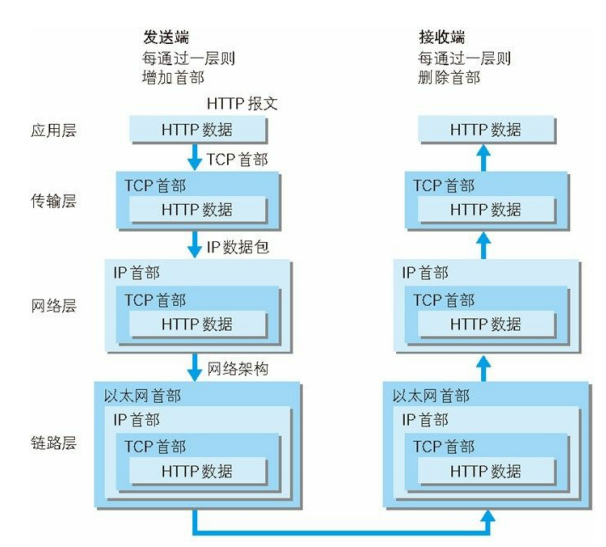

# 图解HTTP

## 通信双方的简易过程

- 发送端从上到下层层打包，接收端从下到上层层解包
  - “层”的概念
    - 应用层：向用户提供应用服务时通信的活动，如生成HTTP报文。
    - 传输层：向上层应用层提供端到端的数据传输。如将HTTP报文分隔成段，并编好序号。
    - 网络层：将传输层过来的报文加上IP首部，然后进行转发。这里涉及到的主要的协议就是：IP协议，OSPF开放最短路径优先协议，ARP地址解析协议。其中OSPF就是在多个路由器中进行路由原则，ARP协议是根据IP地址查找MAC地址，从而进行路由
    - 数据链路层：屏蔽网络硬件部分对传输的影响。

​    

## 